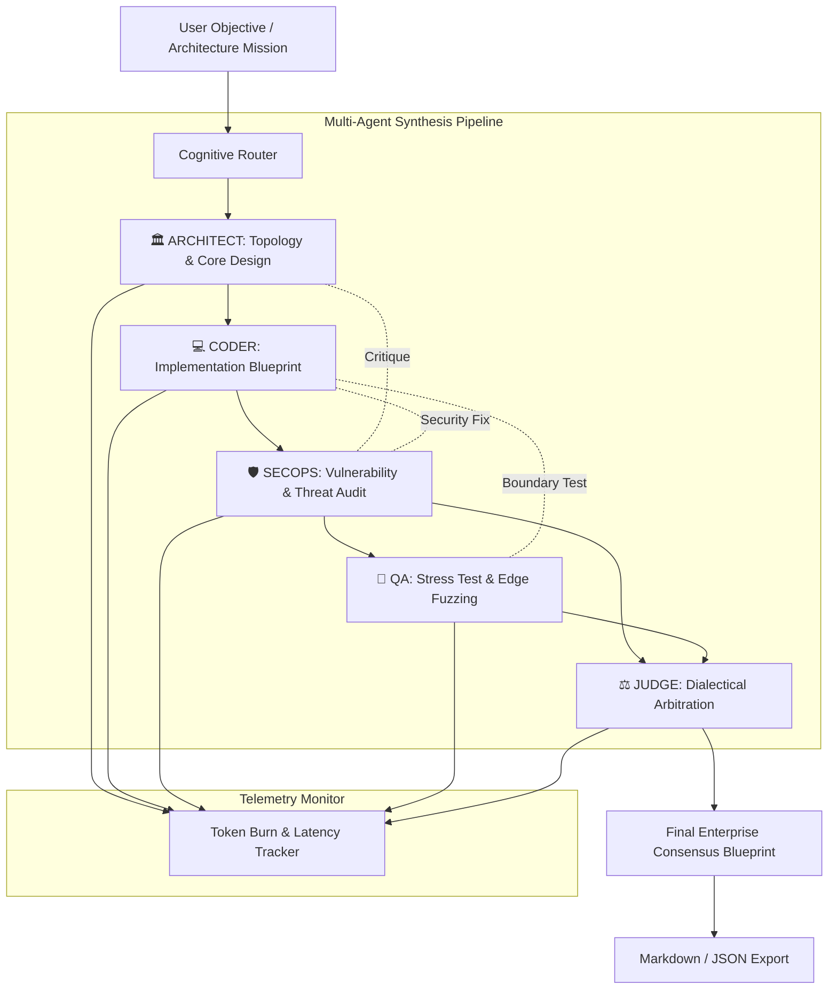

# 🧠 NeuroForge AI — Autonomous Multi-Agent Consensus & Adversarial Debate Studio

<p align="center">
  
  
  
  
  
  
  
</p>

> 🚀 **Live Production Application:** [https://olyxmintabansos-byte.github.io/neuroforge-ai/](https://olyxmintabansos-byte.github.io/neuroforge-ai/)

---

### 🌐 System Overview & Vision

**NeuroForge AI** adalah studio orkestrasi *Autonomous Multi-Agent Consensus* dan *Adversarial Debate Engine* yang dirancang untuk memecahkan dilema arsitektur komputasi tingkat tinggi, audit keamanan siber, serta sintesis sistem enterprise end-to-end.

Berbeda dari model obrolan AI linier tradisional, NeuroForge mensimulasikan dinamika dewan pakar (*council of specialized cognitive agents*) yang saling berkolaborasi, mendebat, mengkritik celah kode, dan memverifikasi trade-off sebelum merumuskan satu konsensus arsitektur final yang kokoh. Seluruh orkestrasi berjalan di sisi klien (**Client-Side Local-First**) dengan telemetri pembakaran token real-time.

---

### 👥 The 5 Cognitive Agent Personas

| Persona | Role | Specialty & Focus | Color Matrix |
|---|---|---|:---:|
| 🏛️ **ARCHITECT** | System Design | Distributed topology, high-availability data pipeline, and zero-trust design | Cyan |
| 💻 **CODER** | Implementation | Pure algorithmic code synthesis, type-safety, and concrete implementations | Emerald |
| 🛡️ **SECOPS** | Security & Audit | Threat modeling, cryptographic validation, zero-day & OWASP Top 10 defense | Rose |
| 🧪 **QA** | Testing & Chaos | Boundary fuzzing, race-condition detection, edge-case failure assertions | Amber |
| ⚖️ **JUDGE** | Arbitration | Dialectical arbitration, compromise scoring, and final architectural synthesis | Violet |

---

### 🌟 Key Functional Pillars

#### 1. ⚙️ Autonomous Multi-Agent Orchestrator
- **Mission Execution Loops:** Jalankan misi arsitektur tingkat lanjut (*System Design*, *Security Audit*, *Performance Stress Test*, *Fullstack Synthesis*).
- **Inter-Agent Critique Chains:** Agen Coder menghasilkan kode solusi, SecOps mengeksploitasi potensi celah keamanan (*vulnerability attack vectors*), QA menguji skenario ekstrem, dan Architect menyelaraskan arsitektur.
- **Unified Architectural Synthesis:** Penghasilan dokumen cetak biru komprehensif lengkap dengan ringkasan eksekutif, diagram dependensi, dan rekomendasi implementasi.

#### 2. ⚔️ Adversarial Debate Arena
- **Dialectical Thesis vs Antithesis:** Perdebatan sengit antara 2 agen berlawanan (*PRO vs CONTRA*) mengenai paradigma software engineering kritis (contoh: *Microservices vs Modular Monolith*, *Serverless vs Bare-Metal Kubernetes*, *Client-Side Local-First vs Centralized Cloud*).
- **Scored Argument Turns:** Setiap argumen dinilai berdasarkan bobot bukti (*argument score*), logika bantahan, dan serangan vektor teknis.
- **Arbiter Verdict:** Agen Arbiter merumuskan putusan akhir (*verdict*) yang merangkum pelajaran teknis paling berharga dari kedua kubu.

#### 3. 📊 Token ROI & Performance Telemetry
- **Granular Token Metrics:** Pemantauan konsumsi prompt tokens, completion tokens, dan total token burn per putaran per agen.
- **Latency & Throughput Tracking:** Pengukuran durasi pemrosesan latensi (*ms*) dan estimasi cost efficiency.
- **Visual Workload Distribution:** Diagram beban kerja kognitif tiap persona dalam mencapai konsensus.

#### 4. 📤 Full-Fidelity Blueprint Export
- **Multi-Format Export Modal:** Ekspor seluruh rekaman debat, argumen bertingkat, dan sintesis arsitektur ke format **Markdown (.md)** atau **Structured JSON** siap pakai untuk dokumentasi tim engineering.

---

### 🏗️ Architecture & Dialectical Flow



---

### 📁 Directory Layout

```
neuroforge-ai/
├── public/
│   └── .nojekyll                 # Jekyll bypass for GitHub Pages
├── src/
│   ├── app/
│   │   ├── layout.tsx            # Global layout & dark-mode neural theme
│   │   └── page.tsx              # Main studio tabs (Orchestrator, Debate, Telemetry)
│   ├── components/
│   │   ├── DebateArena.tsx       # Adversarial debate ring & turn visualization
│   │   ├── ExportModal.tsx       # Blueprint export (Markdown / JSON)
│   │   ├── Navbar.tsx            # Studio header & lifetime token counter
│   │   └── TokenAnalytics.tsx    # Token burn & persona workload charts
│   ├── context/
│   │   └── NeuroForgeContext.tsx # Multi-agent state machine & dialectical engine
│   ├── lib/                      # Helper algorithms, presets & formatting
│   └── types/
│       └── neuroforge.ts         # Agent roles, mission & debate interfaces
├── next.config.ts                # Static export configuration
└── package.json                  # Dependencies & scripts
```

---

### 🛠️ Technology Stack

| Domain | Technology / Library | Rationale |
|---|---|---|
| **Framework** | Next.js 16 (App Router) | Client-side export optimized for zero server hosting costs |
| **Language** | TypeScript (Strict Mode) | Type-safe multi-agent message contracts and schemas |
| **Styling** | Tailwind CSS v4 | High-performance CSS-first zero-runtime utility styling |
| **Icons & UI** | Lucide React | Futuristic cybernetic iconography |
| **State Machine** | React Context + Local-First | Autonomous reactive agent loops without external locks |
| **Deployment** | GitHub Pages (`gh-pages`) | Static hosting with `.nojekyll` bypass |

---

### 🚀 Getting Started & Local Development

Clone repositori dan jalankan pada local development environment:

```bash
# 1. Clone repository
git clone https://github.com/olyxmintabansos-byte/neuroforge-ai.git
cd neuroforge-ai

# 2. Install dependencies
npm install

# 3. Jalankan development server
npm run dev
```

Buka [http://localhost:3000](http://localhost:3000) pada browser Anda.

#### Build & Static Export

```bash
# Build static export ke direktori out/
npm run build

# Deploy langsung ke GitHub Pages branch gh-pages
npx --yes gh-pages -d out -b gh-pages --dotfiles
```

---

### 📄 License & Attribution

Didistribusikan di bawah lisensi MIT. Silakan gunakan untuk keperluan riset arsitektur maupun implementasi enterprise.

<p align="center">
  
  
</p>

<p align="center">
  <strong>© 2026 by Olyx (@olyxmintabansos-byte)</strong> • All rights reserved.
</p>
